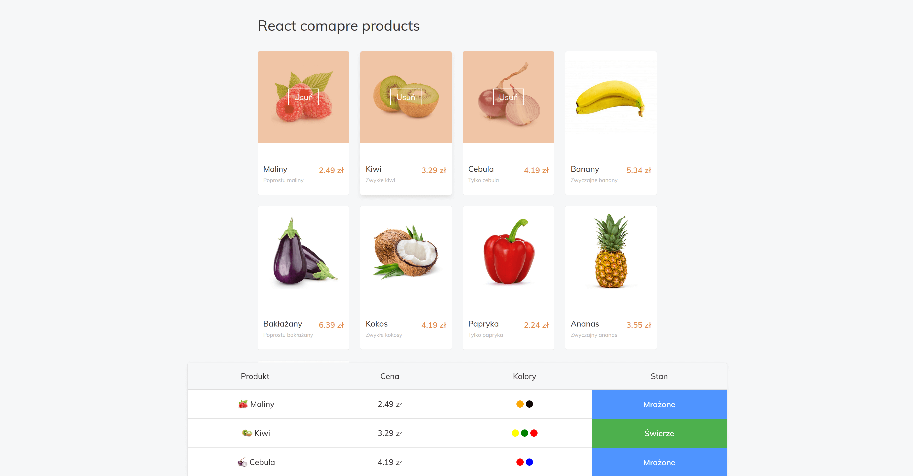

# React - Product Compare
https://rawfour.github.io/compare-products-react/



## Table of contents
* [Instructions](#Instructions)
* [Description](#Description)
* [Technologies](#Technologies)


## Instructions

First clone this repository.
```bash
$ git clone https://github.com/rawfour/compare-products-react.git
```

Install dependencies. Make sure you already have [`nodejs`](https://nodejs.org/en/) & [`npm`](https://www.npmjs.com/) installed in your system.
```bash
$ npm install # or yarn
```

Run it
```bash
$ npm start # or yarn start
```

## Description
This is simple product compare page built in React.
 
## Technologies
Project uses:
* React
* Bootstrap
* SASS
* BEM methodology

